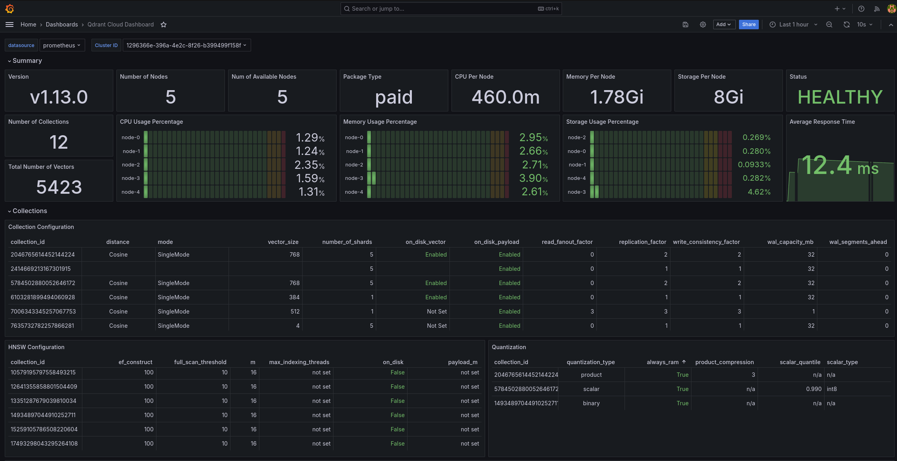

# Qdrant Multi-Node Cluster

<p align="center">
  
</p>

<p align="center">
  <a href="https://github.com/Mohitkr95/qdrant-multi-node-cluster"></a>
  <a href="https://mohitkr95.github.io/qdrant-multi-node-cluster/"></a>
  <a href="https://github.com/Mohitkr95/qdrant-multi-node-cluster/blob/main/LICENSE"></a>
  <a href="https://github.com/Mohitkr95/qdrant-multi-node-cluster/releases"></a>
  <a href="https://github.com/Mohitkr95/qdrant-multi-node-cluster/issues"></a>
  <a href="https://python.org"></a>
  <a href="https://github.com/Mohitkr95/qdrant-multi-node-cluster/stargazers"></a>
</p>

<p align="center">
  <b>Scalable vector database deployment for efficient similarity search across multiple nodes</b>
</p>

---

## 📖 Overview

This project demonstrates a scalable, distributed deployment of [Qdrant](https://qdrant.tech/), a high-performance vector database. It showcases how to set up multiple Qdrant nodes in a clustered configuration, enabling efficient vector search operations with high availability and performance.

Qdrant is designed for enterprise-grade vector similarity search, supporting a wide range of use cases:

- **Semantic text search**: Find documents with similar meaning, not just keywords
- **Image similarity**: Locate visually similar images
- **Recommendation systems**: Suggest products, content, or services
- **Anomaly detection**: Identify outliers in vector spaces
- **Chatbot knowledge base**: Power semantic retrieval for AI assistants

## ✨ Key Features

- **🔄 Scalable Multi-Node Architecture**: Deploy 3+ Qdrant nodes that work as a unified cluster
- **📊 Dynamic Sharding**: Distribute vector data across nodes with customizable sharding strategies
- **🏠 High Availability**: Built-in replication for fault tolerance and continuous operation
- **📈 Monitoring Stack**: Integrated Prometheus and Grafana for real-time metrics visualization
- **🐍 Python Client Integration**: Comprehensive demo application showing cluster interaction
- **🐳 Docker-Based Deployment**: Simple setup using Docker Compose
- **🔧 Detailed Configuration**: Extensive options for tuning and optimizing performance

## 🚀 Quick Start

### Prerequisites

- Docker and Docker Compose
- Python 3.8+
- Git

### Installation

```bash
# Clone the repository
git clone https://github.com/Mohitkr95/qdrant-multi-node-cluster.git
cd qdrant-multi-node-cluster

# Install the package and dependencies
pip install -e .
```

### Deploy the Cluster

```bash
# Start the Qdrant cluster with Prometheus and Grafana
cd deployments/docker
docker-compose up -d
```

### Run the Demo

```bash
# Run the demonstration
python src/run_demo.py

# Or with custom parameters
python src/run_demo.py --host localhost --port 6333 --points 2000
```

### Access Services

- **Qdrant API**: [http://localhost:6333](http://localhost:6333)
- **Prometheus**: [http://localhost:9090](http://localhost:9090)
- **Grafana**: [http://localhost:3000](http://localhost:3000) (default login: admin/admin)

## 📋 Documentation

Comprehensive documentation is available in the [docs](./docs) directory:

- [Getting Started Guide](./docs/guides/getting-started.md)
- [Architecture Overview](./docs/guides/architecture.md)
- [Configuration Guide](./docs/guides/configuration.md)
- [API Reference](./docs/api/reference.md)
- [Performance Tuning](./docs/guides/performance.md)
- [Troubleshooting](./docs/guides/troubleshooting.md)

## 🛠️ Project Structure

```
qdrant-multi-node-cluster/
├── config/                    # Configuration files
│   ├── grafana.json           # Grafana dashboard configuration
│   └── prometheus.yml         # Prometheus configuration
├── deployments/               # Deployment files
│   └── docker/                # Docker-related files
│       └── docker-compose.yml # Docker Compose configuration
├── docs/                      # Documentation
│   ├── api/                   # API documentation
│   ├── guides/                # User guides
│   └── images/                # Documentation images
├── src/                       # Source code
│   ├── qdrant_demo/           # Main package
│   │   ├── config/            # Configuration settings
│   │   ├── core/              # Core functionality
│   │   └── utils/             # Utility functions
│   └── run_demo.py            # Main entry point
├── tests/                     # Test files
├── LICENSE                    # MIT License
├── Makefile                   # Development commands
├── README.md                  # Project overview
├── requirements.txt           # Python dependencies
└── setup.py                   # Package setup file
```

## 📊 Monitoring and Visualization

This project integrates Prometheus for metrics collection and Grafana for visualization, providing real-time insights into your Qdrant cluster's performance.

<p align="center">
  
</p>

## 🔍 Advanced Configuration

### Sharding Configuration

Customize sharding to distribute data efficiently:

```python
# In settings.py
SHARD_NUMBER = 4  # Default shard count
```

### Vector Parameters

Configure vector dimensions and distance metrics:

```python
# In cluster_demo.py
client.create_collection(
    collection_name=self.collection_name,
    vectors_config=models.VectorParams(
        size=self.vector_size,  # 768 by default 
        distance=models.Distance.COSINE
    ),
    # ...other parameters
)
```

### Adding More Nodes

Extend the cluster by adding more nodes in `docker-compose.yml`:

```yaml
qdrant_node4:
  image: qdrant/qdrant:v1.6.1
  volumes:
    - ./data/node4:/qdrant/storage
  depends_on:
    - qdrant_node1
  environment:
    QDRANT__CLUSTER__ENABLED: "true"
  command: "./qdrant --bootstrap http://qdrant_node1:6335 --uri http://qdrant_node4:6335"
```

## 🧪 Testing

Run the test suite:

```bash
# Run all tests
make test

# Or directly with Python
python -m unittest discover -s tests
```

## 🤝 Contributing

Contributions are welcome! See our [Contributing Guide](./docs/guides/contributing.md) for details on how to get started.

1. Fork the repository
2. Create a feature branch (`git checkout -b feature/amazing-feature`)
3. Commit your changes (`git commit -m 'Add amazing feature'`)
4. Push to the branch (`git push origin feature/amazing-feature`)
5. Open a Pull Request

## 📜 License

This project is licensed under the MIT License - see the [LICENSE](./LICENSE) file for details.

## 👏 Acknowledgments

- [Qdrant](https://qdrant.tech/) for the excellent vector database
- [Prometheus](https://prometheus.io/) and [Grafana](https://grafana.com/) for monitoring capabilities
- All [contributors](https://github.com/Mohitkr95/qdrant-multi-node-cluster/graphs/contributors) who help improve this project

## 📧 Contact

Mohit Kumar - [@Mohitkr95](https://github.com/Mohitkr95)

Project Link: [https://github.com/Mohitkr95/qdrant-multi-node-cluster](https://github.com/Mohitkr95/qdrant-multi-node-cluster)
