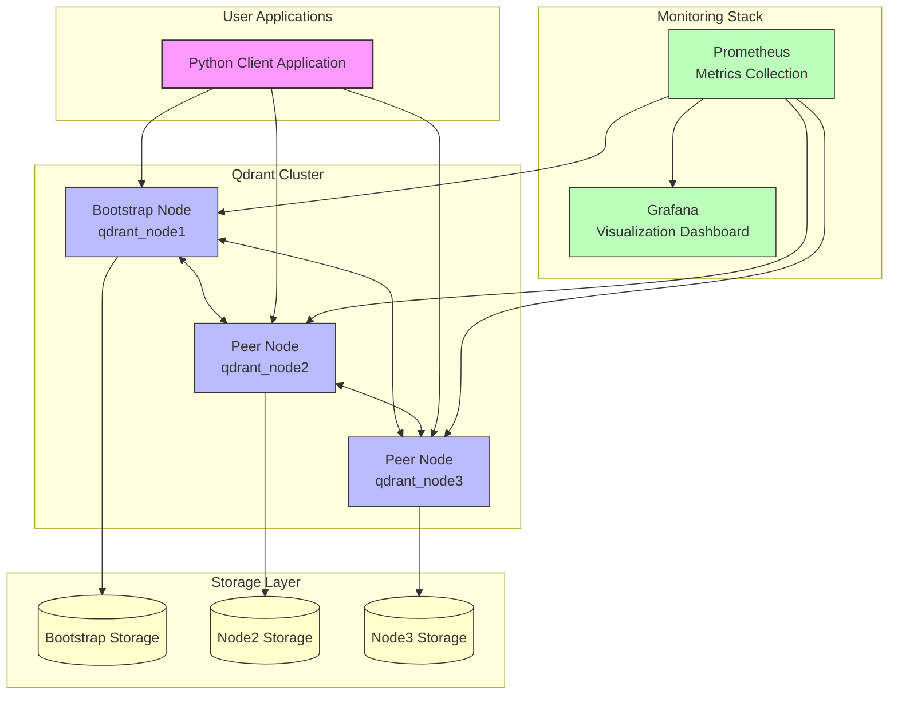
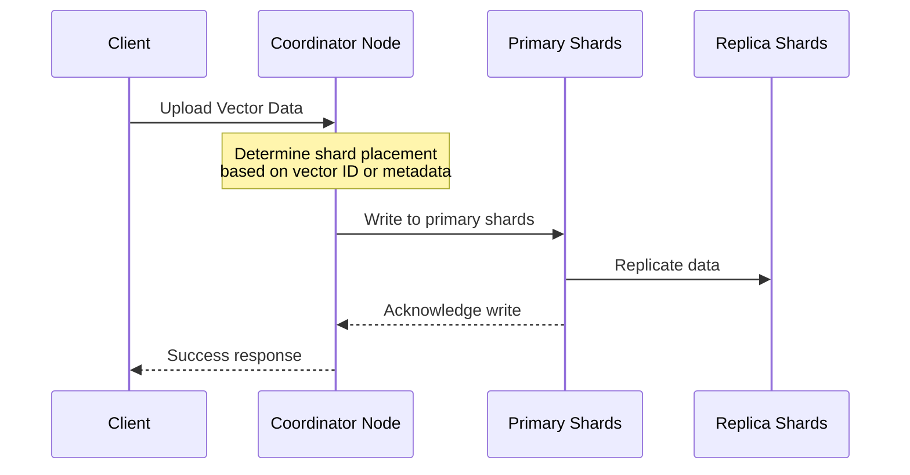
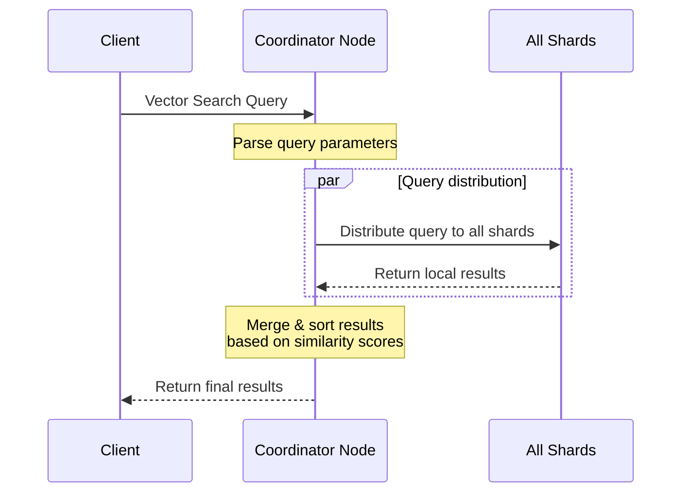

# Architecture Overview

This document outlines the architecture of the Qdrant Multi-Node Cluster setup, explaining the various components and how they interact to form a cohesive, distributed vector database system.

## High-Level Architecture

The system consists of the following primary components:

1. **Qdrant Cluster**: Multiple Qdrant nodes working together
2. **Client Application**: Python application to interact with the cluster
3. **Monitoring Stack**: Prometheus and Grafana for observability

## Qdrant Cluster Components

### Node Structure

The Qdrant cluster is organized in a bootstrap topology with three main node types:

- **Bootstrap Node** (`qdrant_node1`): The initial node that other nodes connect to
- **Peer Nodes** (`qdrant_node2`, `qdrant_node3`): Nodes that join the cluster by connecting to the bootstrap node
- **Client Interface**: All nodes expose the same API interface, making the cluster appear as a single system

### Clustering Mechanism

Qdrant uses a consensus algorithm for cluster management:

1. **Peer Discovery**: Nodes discover each other through the bootstrap node
2. **Consensus Protocol**: Ensures data consistency across nodes
3. **Automatic Failover**: If a node fails, the cluster continues to operate

### Sharding and Replication

The cluster distributes data using these mechanisms:

- **Sharding**: Data is partitioned across nodes based on a shard key
  - Default configuration uses 4 shards
  - Each shard can handle a portion of the vector data
  
- **Replication**: For high availability, data is replicated across nodes
  - Ensures data remains available even if a node fails
  - Improves read performance through distributed query processing

## Data Flow

### Write Operations

When vectors are added to the collection:

1. Client sends vector data to any node in the cluster
2. The node determines the appropriate shard based on vector ID or metadata
3. Data is written to the primary shard
4. Replication ensures data is copied to other nodes

### Read Operations (Vector Search)

When a search query is executed:

1. Client sends a search request to any node
2. The coordinator node distributes the query to all shards
3. Each shard performs local vector search
4. Results are collected and merged based on similarity scores
5. Final results are returned to the client

## Monitoring Architecture

### Metrics Collection

- **Prometheus**: Scrapes metrics from each Qdrant node
  - Collects performance data, resource usage, and query statistics
  - Stores time-series data for historical analysis

### Visualization

- **Grafana**: Connects to Prometheus to visualize metrics
  - Pre-configured dashboards show cluster health and performance
  - Alerts can be configured for critical conditions

## Client Application Architecture

The Python client application demonstrates interaction with the cluster:

- **Connection Management**: Establishes and maintains connection to the cluster
- **Collection Management**: Creates and configures collections with appropriate sharding
- **Vector Operations**: Handles insertion and search of vector data
- **Error Handling**: Manages network and cluster-related errors

## Configuration Architecture

The system uses a layered configuration approach:

1. **Default Configuration**: Base settings defined in code
2. **Environment Variables**: Docker-specific settings through environment variables
3. **Command-line Arguments**: Runtime customization for the client application

## Security Considerations

While this is a demonstration project, in a production environment:

- Network security: Use private networks or VPNs for inter-node communication
- Authentication: Enable Qdrant's authentication mechanisms
- Encryption: Configure TLS for client-cluster communication

## Scalability Aspects

The architecture allows for horizontal scaling:

- **Adding Nodes**: New nodes can join the cluster using the bootstrap mechanism
- **Rebalancing**: Data can be rebalanced across nodes as the cluster grows
- **Load Distribution**: Client requests can be distributed across multiple nodes

## Future Architecture Enhancements

Potential improvements to the architecture:

- **Load Balancer**: Add a dedicated load balancer for client requests
- **Multiple Consensus Groups**: For very large clusters
- **Cross-Region Deployment**: Geographical distribution for global availability 